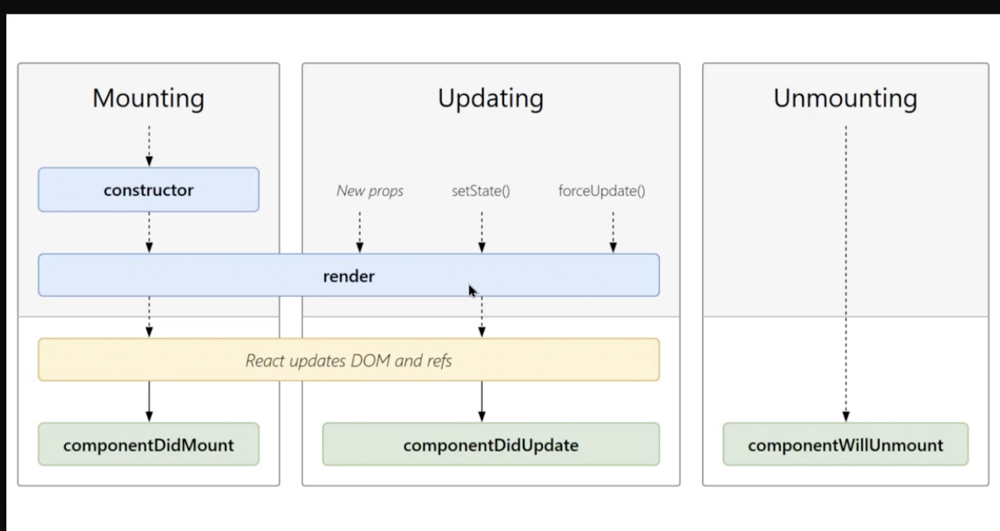

## Component life cycle

## Why is my component rendered twice? (two console.logs in the constructor)?

O ficheiro `index.js` contém um `React.StrictMode` acima de todos os componentes. Isso força os nossos componentes a estarem de acordo com alguns padrões de desenvolvimento do React.

Um desses padrões é que os **componentes sejam "puros"** (no conceito de programação funcional). Ou seja, cada execução, o retorno da função do componente deve ser exatamente o mesmo. Exatamente por isso ele renderiza o componente duas vezes (e passa pelo constructor 2 vezes também).

Não devemos remover o StrictMode de lá, porque ele ajuda nos a previnir erros e deixar a aplicação padronizada durante o desenvolvimento.

### util links:

- https://pt-br.reactjs.org/docs/react-component.html#component-life-cycle

- https://pt-br.reactjs.org/docs/strict-mode.html
