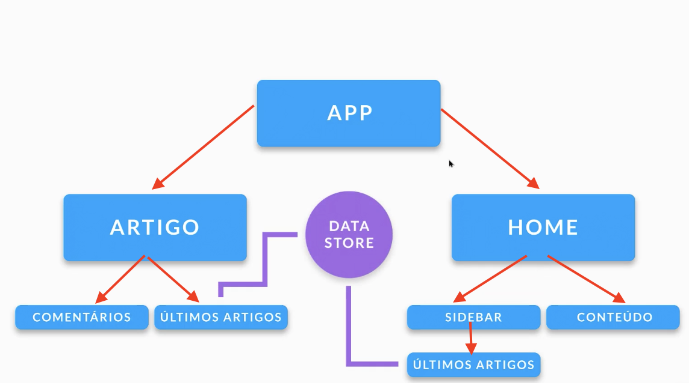
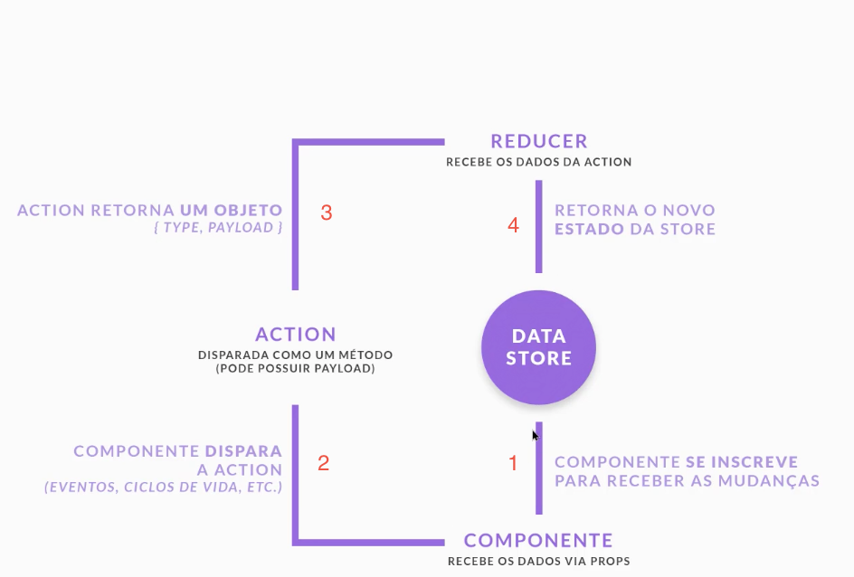

# Redux

- [Documentação oficial do Redux](https://redux.js.org/)  
- [React Redux](https://redux.js.org/faq/react-redux#react-redux)


## why we need it



The main goal it to have a central datastore that can be used by any component of our application.

### flow


#### Advantages:

- Maintenance
- Single data routing
- Single source of truth
- Helps control the UI
- Data persistence

## Installing redux

- https://redux.js.org/introduction/core-concepts

- manual in package.json
```json
"react-redux": "^7.2.6",
"redux": "^4.1.2",
        
"@types/react-redux": "^7.1.20",
```
- using yarn
```
yarn add react-redux
yarn add redux
yarn add -D @types/react-redux
```
- using npm
```
npm i react-redux redux
npm i -D @types/react-redux
```

---

4.2. Simple configuration of redux

```diff
Index: Section-others/x-stocks/src/index.tsx
IDEA additional info:
Subsystem: com.intellij.openapi.diff.impl.patch.CharsetEP
<+>UTF-8
===================================================================
diff --git a/Section-others/x-stocks/src/index.tsx b/Section-others/x-stocks/src/index.tsx
--- a/Section-others/x-stocks/src/index.tsx	(revision 7b63cbcab7704cb14524080fd79e2c76a6c12597)
+++ b/Section-others/x-stocks/src/index.tsx	(date 1636299876822)
@@ -3,11 +3,16 @@
 import './index.css';
 import App from "./components/App";
 
+import store from "./redux";
+import {Provider} from "react-redux";
+
 ReactDOM.render(
-  <React.StrictMode>
-    <App />
-  </React.StrictMode>,
-  document.getElementById('root')
+    <React.StrictMode>
+        <Provider store={store}>
+            <App/>
+        </Provider>
+    </React.StrictMode>,
+    document.getElementById('root')
 );
 
 // If you want to start measuring performance in your app, pass a function
Index: Section-others/x-stocks/package.json
IDEA additional info:
Subsystem: com.intellij.openapi.diff.impl.patch.CharsetEP
<+>UTF-8
===================================================================
diff --git a/Section-others/x-stocks/package.json b/Section-others/x-stocks/package.json
--- a/Section-others/x-stocks/package.json	(revision 7b63cbcab7704cb14524080fd79e2c76a6c12597)
+++ b/Section-others/x-stocks/package.json	(date 1636293442242)
@@ -13,7 +13,9 @@
     "axios": "^0.24.0",
     "react": "^17.0.2",
     "react-dom": "^17.0.2",
+    "react-redux": "^7.2.6",
     "react-scripts": "4.0.3",
+    "redux": "^4.1.2",
     "sweetalert2": "^11.1.9",
     "typescript": "^4.1.2",
     "web-vitals": "^1.0.1"
@@ -43,6 +45,7 @@
     ]
   },
   "devDependencies": {
+    "@types/react-redux": "^7.1.20",
     "node-sass": "^5.0.0"
   }
 }
Index: Section-others/x-stocks/src/redux/Products/Products.reducer.ts
IDEA additional info:
Subsystem: com.intellij.openapi.diff.impl.patch.CharsetEP
<+>UTF-8
===================================================================
diff --git a/Section-others/x-stocks/src/redux/Products/Products.reducer.ts b/Section-others/x-stocks/src/redux/Products/Products.reducer.ts
new file mode 100644
--- /dev/null	(date 1636299633870)
+++ b/Section-others/x-stocks/src/redux/Products/Products.reducer.ts	(date 1636299633870)
@@ -0,0 +1,15 @@
+export interface Action<T = any> {
+    type: string,
+    payload?: T
+}
+
+// 1. first we create the redux reducer
+export default function (state = [], action: Action) {
+    switch (action.type) {
+
+        case 'INSERT_NEW_PRODUCT':
+            return [...state, action.payload]
+        default:
+            return state
+    }
+}
Index: Section-others/x-stocks/src/redux/Products/Products.actions.ts
IDEA additional info:
Subsystem: com.intellij.openapi.diff.impl.patch.CharsetEP
<+>UTF-8
===================================================================
diff --git a/Section-others/x-stocks/src/redux/Products/Products.actions.ts b/Section-others/x-stocks/src/redux/Products/Products.actions.ts
new file mode 100644
--- /dev/null	(date 1636294040623)
+++ b/Section-others/x-stocks/src/redux/Products/Products.actions.ts	(date 1636294040623)
@@ -0,0 +1,17 @@
+import {Action} from "./Products.reducer";
+import {Product} from "../../model/Product";
+
+// 2. create redux actions
+export const insertNewProduct = (): Action<Product> => {
+    return {
+        type: 'INSERT_NEW_PRODUCT',
+        payload: {
+            _id: '2345',
+            name: 'Dummy product',
+            price: 10.5,
+            stock: 3,
+            createAt: undefined,
+            updatedAt: undefined
+        }
+    }
+}
Index: Section-others/x-stocks/src/redux/index.ts
IDEA additional info:
Subsystem: com.intellij.openapi.diff.impl.patch.CharsetEP
<+>UTF-8
===================================================================
diff --git a/Section-others/x-stocks/src/redux/index.ts b/Section-others/x-stocks/src/redux/index.ts
new file mode 100644
--- /dev/null	(date 1636299799958)
+++ b/Section-others/x-stocks/src/redux/index.ts	(date 1636299799958)
@@ -0,0 +1,13 @@
+import {combineReducers, createStore} from "redux";
+import Products from './Products/Products.reducer';
+
+
+const reducers = combineReducers({
+
+    products: Products
+
+});
+
+const store = createStore(reducers);
+
+export default store;

```


## 4.2. Redux dev tool chrome extension

https://chrome.google.com/webstore/detail/redux-devtools/lmhkpmbekcpmknklioeibfkpmmfibljd?hl=pt-BR

https://github.com/zalmoxisus/redux-devtools-extension


## 4.5. Fire redux actions from components

- [Fire redux actions from components](https://redux.js.org/tutorials/fundamentals/part-2-concepts-data-flow)


## 4.6. Redux Thunk: Actions Async

- [Redux Thunk](https://github.com/reduxjs/redux-thunk)
- https://redux.js.org/recipes/usage-with-typescript
- https://redux.js.org/recipes/usage-with-typescript

```
$ yarn add redux-thunk
```

```
redux-thunk@2.4.0
```


###

- documentation: https://redux-toolkit.js.org/usage/usage-with-typescript
